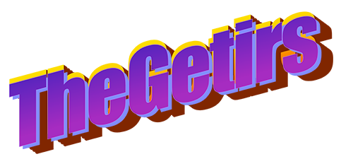

<div style="background-color: rgb(167, 202, 212); border-radius: 15px; padding: 5px">
<image src="media/images/logo.png" style="margin-left: -2px; border-radius: 15px"></image>
</div>

## Run it with Parcel!
* Download/clone the project
* In the project folder:
```console
npm i
npm start
```
* In case this error occurs:
```console
Browserslist: caniuse-lite is outdated. Please run next command `npm update caniuse-lite browserslist`
Browserslist: caniuse-lite is outdated. Please run next command `npm update caniuse-lite browserslist`
```

* Solve with:
    
```
npm update caniuse-lite browserslist
```

NB: tested on Chrome and Firefox

# Functionalities
Here is a <a href="https://youtu.be/R05Z8otmfb4">DEMO video</a>!

<div>
<image src="media/images/gui.png" style="border-radius: 15px; margin-bottom: 10px;"></image>
</div>

* Granular synthesizer with customizable parameters
* Possibility to use some presets we prepared for our users
* Possibility to save you very own parameter sets
* 4 parametric effects to play with: Delay, Reverb, Distortion and a LPF
* Mappable MIDI controls to play the synthesizer and change its parameters

# Customizable parameters
## Synthesizer knobs
* Density: time density of the played grains
* Spread: area around the waveform pointer in which the grains to be played are created
* Pitch: perceived frequency of the played grains
* Attack: envelope attack of each single grain
* Release: envelope release of each single grain
* Volume: master volume of the synthesizer

## Effects
### Delay
* Feedback: the amount of signal fed back to be delayed
* Time: actual time delay
### Reverb
* Decay: seconds of decay of the reverb
### Distortion
* Amount: quantity of distortion applied to the grains
### LPF
* Cutoff: frequency at which the filter begins to attenutate the signal
* Resonance:  emphasis or suppression of portions of the signal above or below the defined cutoff frequency

# Implementation

## Used libs
* Granular
* Wavesurfer
* Firebase & Firestore
* P5
* JQuery & JQuery-Knob
* Bootstrap & Popper

## DB structure
Collections:
* presets: which contains all 4 presets designed by us for you to play with
* user_presets: which contains all sets of parameters saved by the users
* preset_num: which contains the counter for the saved sets

# References

* VST:
Quanta - Granular Synth by Audio Damage

* Artists and songs:
    * Tim Hecker - Chimeras
    * Arca - Alive
    * Flume - Voices
    * Ighlooghost - Bug Thief

# Authors
Gargiulo - Morena - Orsatti - Perego
<br>
 
